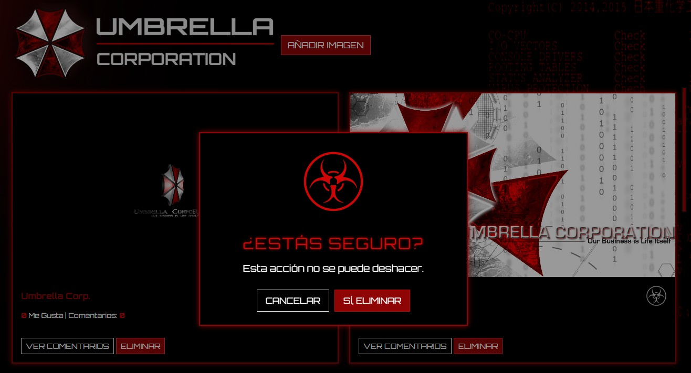

###### M07 UF4 Act1

<p align="center">
  
</p>

Este sitio es un portal donde los usuarios pueden subir imágenes, ambientado como si formara parte del software interno de la empresa Umbrella Corporation, del universo de Resident Evil. Permite añadir imágenes con descripción, comentar sobre ellas y marcarlas con un "Me gusta" mediante un icono biohazard que cambia de color al marcarse. La carga de contenido es dinámica y el sistema de scroll se adapta automáticamente a la aparición de nuevas imágenes, de 4 en 4.
El sitio está diseñado para ejecutarse en modo pantalla completa en un monitor 1080p. No obstante, gracias al uso del framework Bootstrap, el diseño se adapta correctamente a resoluciones mayores, como 1440p.
El acceso al sitio se realiza desde la carpeta frontend, a través del archivo index.php. (En un futuro deberia crearse un login register y establecerse como entarda principal)


---

## ☣ Tecnologías utilizadas ☣

- **PHP** (con SQLite) para el backend  
- **HTML/CSS/JS** para el frontend  
- **Bootstrap 5** para estilos  
- **Font Awesome** para iconos  
- **Fetch API** para comunicación asíncrona  
- **SQLite** como base de datos embebida  

---

## ☣ Funcionalidades principales ☣

- **Subida de imágenes** a la galería  
  <p align="left">
    
  </p>

- **Visualización dinámica** de imágenes (2 horizontales, 1 vertical)  
  *(Pendiente de ajustar para mejorar UX/UI)*  
  <p align="left">
    
  </p>

- **Comentarios** por imagen (con scroll interno)  
  <p align="left">
    
  </p>

- **“Me gusta”** con icono biohazard (toggle)  
  <p align="left">
    
  </p>

- **Scroll infinito** con carga progresiva de imágenes  

- **Reproductor de música de fondo** (esquina superior derecha)  
  - **Antiguo**:  
    <p align="left">
      
    </p>  
  - **Nuevo**:  
    <p align="left">
      
    </p>  
  La pista se reproduce de forma continua al recargar el sitio, sonido ajustable y el reproductor se despliega al pasar sobre él.

---

## ☣ Vista general ☣
###### Sistema de notificaciones
<p align="left">
  
</p>


###### Sin imágenes
<p align="left">
  
</p>

###### Con imágenes
<p align="left">
  
</p>

<video align="left" width="640" height="360" controls>
  <source src="Elementos/capts/DemostracionUmbrellaCorp.mp4" type="video/mp4">
  Tu navegador no soporta la etiqueta de video.
</video>

---

## ☣ Estructura del Proyecto ☣

```text
Elementos/
├── ...                    # Contiene los elementos para el front (Banners, logos, etc.)

backend/
├── API/
│   ├── imagenesAPI.php    # Gestiona el CRUD de imágenes (listar, añadir, eliminar)
│   ├── comentariosAPI.php # Gestiona añadir y recuperar comentarios por imagen
│   └── megustaAPI.php     # Gestiona la funcionalidad de "Me Gusta"
├── config.php             # Conexión a la base de datos SQLite
└── imagenes.db            # Base de datos SQLite con tablas de imágenes, comentarios y likes

frontend/
├── index.php              # Página principal que carga las imágenes, comentarios y botones
├── script.js              # Lógica en JS para interacciones (fetch, scroll, likes, música, etc.)
└── styles.css             # Estilos visuales personalizados (cards, scroll, marca de agua)
```

## ☣ Notas técnicas ☣
- El sistema no requiere login; los "**me gusta**" y **comentarios** se asignan a "**usuario anónimo**".

- Se utiliza **scroll infinito** para cargar imágenes de forma progresiva.

- Los **estilos** son totalmente personalizados con styles.css.
  (por algun motivo se necesita usar !important constantemente)

- La **música** de fondo se gestiona mediante un reproductor simple controlado por el usuario.

- Utilización de la tipografia **Orbitron**, de Google Fonts. Una tipografia realmente bonita y que va muy acorde con la temática.

- El sitio web esta pensado para funcionar en modo Full Screen, en un monitor 1080p.

## ☣ Mejoras a realizar ☣
- Control de audio mejorado, volumen y continuidad en todo el sitio web.
- Creación de usuarios
- Correción dimensiones de las imagenes y cards.
- Creación de un footer dinámico con datos de usuario (actualmente es una imagen estática).
- Comprobaciones del archivo css, correción de la necesidad de !important (el archivo css es 100% funcional).
- Funcionalidad visualizar la imagen tamaño completo.
- Funcionalidad para eliminar comentarios.
- Guardar imagenes.
- Replantear y optimizar las tablas.

## ☣ Observaciones personales ☣
- Todos los elementos han sido creados por mi mismo en Photoshop, menos el logo y los fotomontajes subidos en la galería.
- El proyecto no esta finalizado y hay varios ajustes a realizar, aún asi, podria decir que es uno de mis diseños favoritos.
- Hay varios commits fuera de fecha, eso es porque quiero dejar el sitio pulido, con la mejor experiencia de usuario posible.
#### ☣ Autor ☣
**Tomàs Audi**
[@taudigilabert](https://github.com/taudigilabert)

[Ver documentación de la API en Postman](https://.postman.co/workspace/My-Workspace~cdf686be-bf60-4b86-8659-972d6e72ce54/collection/43536885-fe864964-cd64-4122-b87e-39b1a05b7551?action=share&creator=43536885)
